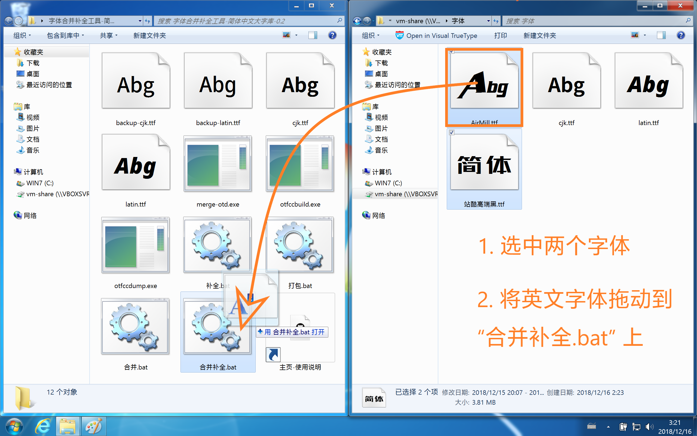

# 魔兽世界字体合并/补全工具<br>(Warcraft Font Merger, aka “WFM”)

## 快速入门

下载[最新版](https://github.com/CyanoHao/Warcraft-Font-Merger/releases/latest)的字体合并补全工具并解压缩。

字体合并补全工具有 4 个版本，各个版本的自带字库不同。
* `WarFontMerger-SC1-版本号.7z`：简体中文压缩字库（覆盖 GB18030，字体文件采用压缩技术，体积小但字形质量一般）。
* `WarFontMerger-SC2-版本号.7z`：简体中文标准字库（覆盖 GB18030，字形质量较好，**推荐**）。
* `WarFontMerger-SC3-版本号.7z`：简体中文大字库（覆盖中日韩各国字符，字形和标准字库一致，体积较大）。
* `WarFontMerger-TC3-版本号.7z`：繁体中文大字库（覆盖中日韩各国字符，字形采用台湾标准，体积较大）。

### 合并两个字体并补全

打开字体合并补全工具文件夹，**选中**需要合并的**两个字体**，然后**拖动英文字体**到 `合并补全.bat` 上，等候片刻即可得到合并完成的字体 `out.ttf`。

操作示意：


合并补全之后的[字体预览图](image/merge-out.png)，不论是[西文部分](image/latin.png)还是[汉字部分](image/cjk.png)都不缺字。

注：
1. 如果想要只合并两个字体不补全，**选中**需要合并的**两个字体**，然后**拖动英文字体**到 `合并.bat` 上即可。
2. 字体补全工具默认使用 `latin.ttf`（西文）和 `cjk.ttf`（中日韩）来补全字体。上面的操作示意图中替换了这两个字体，以更好地匹配原来的字体风格。
3. 先合并再补全，和一次性合并补全的效果不同。一次性合并补全时，优先级依次为：第一个字体、`latin.ttf`、第二个字体、`cjk.ttf`。先合并再补全时，优先级依次为：第一个字体、第二个字体、`latin.ttf`、`cjk.ttf`。

### 补全缺字的字体

打开字体合并补全工具文件夹，将需要补全的字体拖动到 `补全.bat` 上，等候片刻即可得到补全完成的字体 `out.ttf`。

### 生成字体包

打开字体合并补全工具文件夹，把准备好的字体拖动到 `打包.bat` 上，然后将生成的 `Fonts` 文件夹移动到 `World of Warcraft\_retail_\` 下面。

## 特性

* 轻量级：三个可执行文件，总共只有 2 MB 多一点。自带字库的压缩包不超过 10 MB。
* 多功能：既可以合并字体，也可以用来补全缺字的字体。
* 速度快：中英文字体的合并补全只需要 20 秒。

## 限制

* 目前只支持 TrueType 曲线字体（TrueType 或 OpenType/TT，扩展名通常为 `.ttf`），暂不支持 PostScript 曲线字体（OpenType/CFF 或 OpenType/CID，扩展名通常为 `.otf`）。
* 不提供预编译的 32 位版本。WFM 不可避免地需要操纵汉字，而汉字是一个非常庞大的集合，读取并操作汉字需要巨大的内存，32 位程序极易因为超出内存上限而崩溃。

## 编译和运行

### 编译

用 GCC
```bash
g++ src/merge-otd.cpp src/iostream.cpp -Isrc/ -std=c++14 -O2 -o merge-otd
```

或者用 Visual C++
```cmd
cl src\merge-otd.cpp src\iostream.cpp /Isrc\ /std:c++14 /EHsc /O2 /Fe:merge-otd.exe
```

### 运行（需要 [otfcc](https://github.com/caryll/otfcc)）

合并两个字体：
```bash
otfccdump 西文字体.ttf -o base.otd
otfccdump 中文字体.ttf -o cjk.otd
merge-otd base.otd cjk.otd
otfccbuild base.otd -O2 -o 合并之后的字体.ttf
rm *.otd
```

补全缺字的字体：
```bash
otfccdump 需要补全的字体.ttf -o base.otd
otfccdump 收字很全的西文字体.ttf -o latin.otd
otfccdump 收字很全的中文字体.ttf -o cjk.otd
merge-otd base.otd latin.otd cjk.otd
otfccbuild base.otd -O2 -o 补全之后的字体.ttf
rm *.otd
```

合并字体文件的数量原则上只受底层限制（命令行参数、内存、OpenType 字符数量等）：
```bash
otfccdump 基本拉丁字母.ttf -o base.otd
otfccdump 扩展拉丁字母.ttf -o 1.otd
otfccdump 希腊字母.ttf     -o 2.otd
otfccdump 西里尔字母.ttf   -o 3.otd
otfccdump 假名.ttf         -o 4.otd
otfccdump 基本汉字.ttf     -o 5.otd
otfccdump 扩展汉字.ttf     -o 6.otd
otfccdump 谚文.ttf         -o 7.otd
otfccdump 其他CJK符号.ttf  -o 8.otd
merge-otd base.otd 1.otd 2.otd 3.otd 4.otd 5.otd 6.otd 7.otd 8.otd
otfccbuild base.otd -O2 -o 合并之后的字体.ttf
rm *.otd
```

## 开发计划

### 支持对每个字体自定义变换矩阵，并提供图形界面

这样可以更好地匹配原有字体的风格。例如，修改倾斜角度、压缩字符宽度，甚至旋转字符。

### 支持 PostScript 曲线字体

许多高质量的字体采用了 PostScript 曲线，封装为 OpenType/CFF 或 OpenType/CID 字体。由于 OpenType/CFF 或 OpenType/CID 的字体格式与 OpenType/TT 差别很大，目前还没办法支持。

## 感谢

[Belleve Invis](https://github.com/be5invis) 和[李阿玲](https://github.com/clerkma)编写的 [otfcc](https://github.com/caryll/otfcc) 用于解析和生成 OpenType 字体文件。

[Niels Lohmann](https://github.com/nlohmann) 的 [json](https://github.com/nlohmann/json) 库提供了非常漂亮的 C++ JSON 接口。本工具使用了修改版的 `json.hpp`，容许非标准编码的字符。

Google 提供了大量的开源字体，Adobe 提供了高质量的[思源黑体](https://github.com/adobe-fonts/source-han-sans)。
